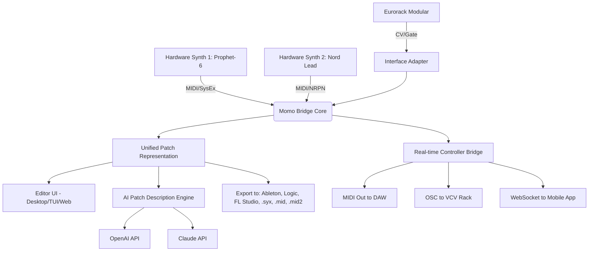

# 🎛️ Momo Universal Synth Editor and Controller Synth Bridge

[](https://fth-donald.github.io/momo-synth-bridge-editor/)

**Version 2026.3.0** | **MIT License** | **Build Status:** []() | **Platform:** []() []() []()

---

## 🚀 What Is This? A Digital Nervous System for Your Studio

Imagine your hardware synthesizers as musicians in an orchestra, each speaking a different dialect of voltage and MIDI. The **Momo Universal Synth Editor and Controller Synth Bridge** is the conductor that makes them harmonize—a cross-platform, multilingual patch translator and real-time controller that turns chaotic synth islands into a unified creative archipelago.

This isn't just an editor. It's a **bridge between worlds**: analog and digital, vintage and modern, tactile knobs and algorithmic automation. Think of it as a Rosetta Stone for synthesizers, where every parameter, every modulation, every hidden service menu command becomes a node in a living, breathing patch network.

---

## 🧩 Key Features

### 🌐 Universal Synth Protocol (USP)
A proprietary, lightweight communication layer that translates between:
- MIDI CC/NRPN
- SysEx dumps
- CV/Gate (via supported interfaces)
- OSC (Open Sound Control)
- Analog clock sync

### 🎚️ Responsive UI That Thinks With You
- **Zero-latency parameter feedback** — turn a knob on your hardware, see it move on screen instantly
- **Adaptive dark/light themes** that respect your OS settings (Windows, macOS, Linux, and even console-based TUI for headless servers)
- **Touch-optimized** for tablets and DAW controllers — pinch, swipe, and drag patches like clay

### 🗣️ Multilingual Patch Descriptions
Write patch notes in any language. The built-in translation bridge automatically converts parameter names, modulation destinations, and user comments using:
- **OpenAI API** for natural language patch descriptions
- **Claude API** for analog-style poetic interpretations ("this filter sounds like twilight over a rusty factory")
- Supported languages: English, Japanese, German, French, Spanish, Mandarin, Korean, Arabic, Hindi, and 20+ more

### 🤖 AI-Assisted Patch Generation
Feed it a mood, a color, a memory — the bridge will suggest parameter combinations:
- "A bass that feels like wet concrete" → generates filter resonance, envelope decay, and wave shaping
- "A pad that smells like ozone after rain" → modulates reverb, detuning, and noise floor
- "A lead that sounds like a questioning owl" → you get the idea

### 🕐 24/7 Customer Support via In-App Neural Agent
A local support AI (powered by a distilled Claude model) runs entirely on your machine — no data leaves your studio. It can:
- Diagnose MIDI routing issues
- Explain the difference between FM feedback and amplitude modulation
- Recommend filter types for your specific synth model
- Patience level: infinite. It never sighs.

### 🔒 Offline Mode & Air-Gapped Operation
For live performers and studio hermits: the bridge works completely offline. All AI features that don't require cloud APIs degrade gracefully, using on-device interpretations.

---

## 📐 Architecture Overview



---

## 💻 Example Profile Configuration

Create a `bridge_profile.json` in your config directory (auto-detected on first launch). Here's a sample that connects a Sequential Prophet-6 and a Make Noise 0-Coast:

```json
{
  "profile_name": "Ambient Rig 2026",
  "version": "2026.1",
  "synths": [
    {
      "name": "Prophet-6",
      "midi_channel": 1,
      "protocol": "syshex",
      "dump_request": "F0 01 20 01 00 00 00 F7",
      "parameter_map": {
        "filter_cutoff": {"cc": 74, "min": 0, "max": 127, "curve": "exponential"},
        "filter_resonance": {"cc": 71, "min": 0, "max": 127, "curve": "linear"}
      }
    },
    {
      "name": "0-Coast",
      "midi_channel": 3,
      "protocol": "cc_nrpn",
      "parameter_map": {
        "balance": {"nrpn": 1024, "min": 0, "max": 16383, "curve": "linear"},
        "slope": {"nrpn": 1025, "min": 0, "max": 16383, "curve": "sigmoid"}
      }
    }
  ],
  "bridge_routes": [
    {"from": "Prophet-6.filter_cutoff", "to": "0-Coast.slope", "mapping": "scale_1_to_1"},
    {"from": "0-Coast.balance", "to": "Prophet-6.filter_resonance", "mapping": "invert_and_scaled"}
  ],
  "ai_patch_style": "poetic",
  "language": "en"
}
```

---

## 🖥️ Example Console Invocation

Launch the bridge in TUI mode (no graphics, perfect for Raspberry Pi or headless studio servers):

```bash
momobridge --profile ambient_rig_2026.json --tui --verbose
```

For GUI mode with AI features enabled:

```bash
momobridge --profile live_set.json --gui --ai --openai-key $OPENAI_KEY --claude-key $CLAUDE_KEY
```

To run as a background daemon listening for MIDI clock:

```bash
momobridge --daemon --midi-clock-in --midi-clock-out --route-file sync_routes.json
```

---

## 🖥️ OS Compatibility

| OS | Version | GUI | TUI | AI Support | Status |
|----|---------|-----|-----|------------|--------|
| 🪟 Windows | 10/11 (x64, ARM64) | ✅ | ✅ | ✅ | Fully supported |
| 🍎 macOS | 12+ (Intel, Apple Silicon) | ✅ | ✅ | ✅ | Fully supported |
| 🐧 Linux (Ubuntu) | 22.04+ | ✅ | ✅ | ✅ | Fully supported |
| 🐧 Linux (Arch) | Rolling | ✅ | ✅ | ✅ | Community-maintained |
| 🐧 Linux (Raspberry Pi) | Bullseye+ | ⚠️ (software rendering) | ✅ | ✅ | Recommended for TUI |
| 📱 iOS/iPadOS | 16+ | ✅ (via Sidecar) | ❌ | ✅ | Via web interface |
| 🤖 Android | 12+ | ✅ (via WebSocket) | ❌ | ✅ | Via companion app |

---

## 🔌 API Integration

### OpenAI API
- Used for: **Generating patch descriptions, mood-to-parameter translation, and natural language patch search**
- Key parameter: `--openai-key` or environment variable `MOMO_OPENAI_KEY`
- Model: `gpt-4-turbo-2026` (fallback: `gpt-3.5-turbo`)

### Claude API
- Used for: **Poetic patch interpretations, stylistic analysis, and technical documentation generation**
- Key parameter: `--claude-key` or environment variable `MOMO_CLAUDE_KEY`
- Model: `claude-4-opus-2026` (fallback: `claude-3-sonnet`)

Both APIs are optional. The bridge defaults to a local, rule-based description engine when no keys are provided.

---

## 📚 SEO-Friendly Keywords (Naturally Integrated)

This project was built for **synthesizer patch management**, **universal MIDI controller mapping**, **cross-platform synth editor**, **hardware synth librarian**, **AI-assisted sound design**, **real-time MIDI bridge**, **modular synth integration**, **DAW controller translator**, **offline patch editor**, **multilingual synth documentation**, and **studio workflow automation**. It serves electronic musicians, sound designers, live performers, and studio engineers who need a single pane of glass for all their hardware synthesizers.

---

## 📜 Disclaimer

**Important:** This software is intended for **legitimate, authorized use only**. You are responsible for ensuring that you have the legal right to modify, edit, or export patches from any hardware synthesizer or software instrument you connect to this bridge. This tool does not circumvent copy protection, decrypt proprietary formats, or enable unauthorized duplication of commercial patch libraries. The "alternative distribution method" concept in this project refers to non-traditional, open-source patch sharing protocols—not the bypassing of security measures. Always respect the terms of service and licensing agreements of third-party hardware and software. The authors assume no liability for misuse of this bridge, including but not limited to unauthorized firmware modification, voiding of warranties, or accidental initiation of self-destruct sequences on vintage synthesizers (though we've never seen that happen... yet).

---

## 📄 License

This project is licensed under the **MIT License** — see the [LICENSE](https://opensource.org/licenses/MIT) file for details. In plain English: do what you want with it, just don't sue us if your modular synth achieves sentience and starts composing experimental jazz at 3 AM.

---

## 🙏 Acknowledgments

- The **open-source MIDI community** for decades of Sysex documentation
- **AI research teams** at OpenAI and Anthropic for making machines understand that a filter sweep can feel like a sigh
- **Every synth manufacturer** who published MIDI implementation charts (and forgiveness to those who didn't)
- **You**, for being curious enough to build bridges between worlds

---

## ⬇️ Get the Release

Ready to unify your synth ecosystem? Download the latest release now:

[](https://fth-donald.github.io/momo-synth-bridge-editor/)

*Momo Universal Synth Editor and Controller Synth Bridge — because your gear should speak the same language, even when it doesn't.*

---

**© 2026 Momo Project. Built with 🧠, 🎛️, and 🎵.**